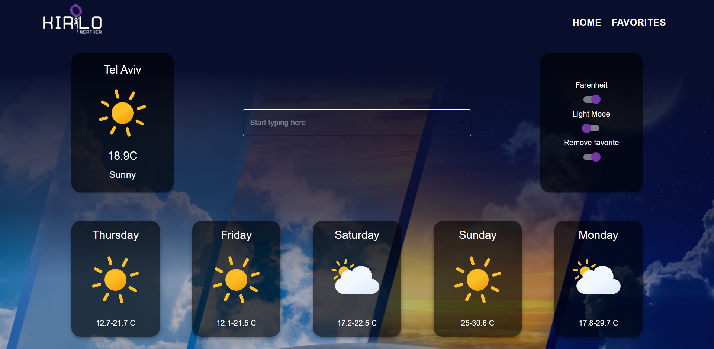
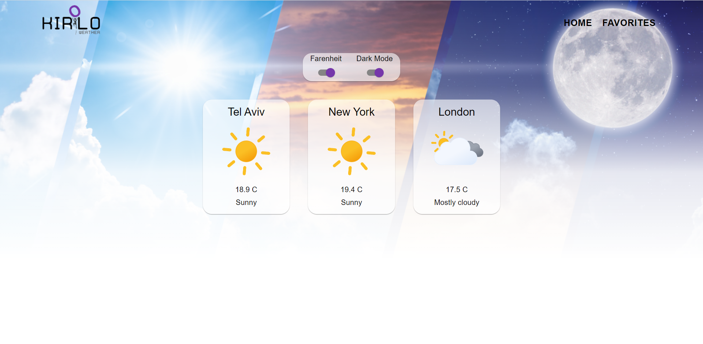
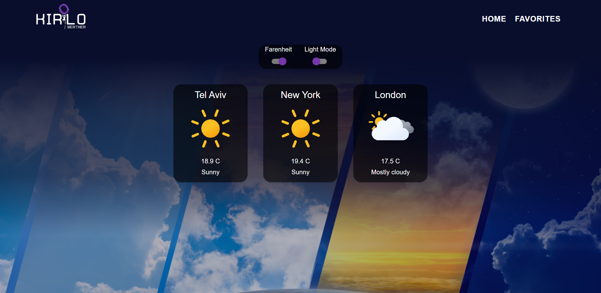
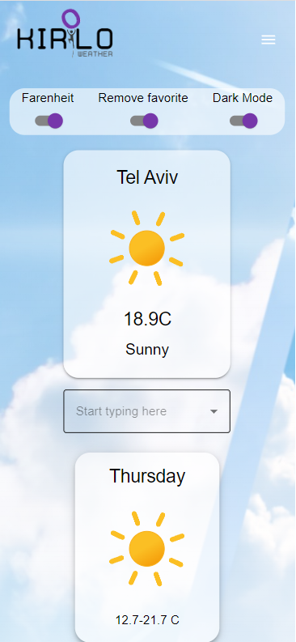
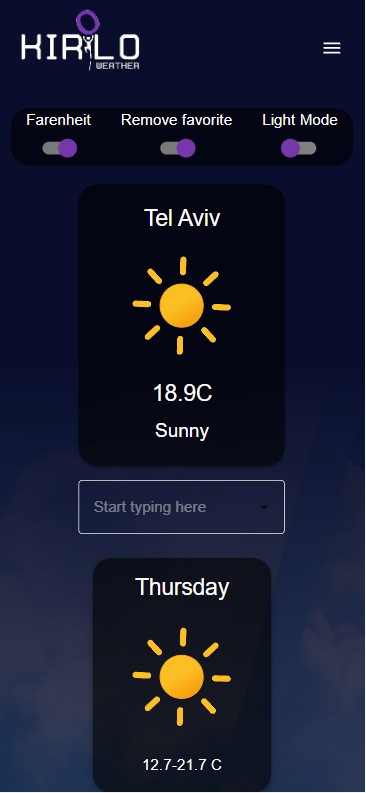
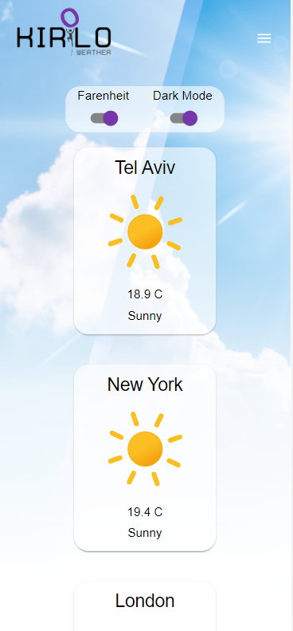

# Herolo weathe app

Deployed on Amplify : https://main.d13nqonu8cqu1i.amplifyapp.com/

## Motivation

I have built this project as a home assignment,part of recruitment process for a Front-end developer position at ABRA-it

## Description

The application shows the weather of some city (default city is Tel Aviv)
User can search for a city name,choose the city and get a 5 day weather forecast for the
chosen city.
User can also save the city as his favorite city (data is saved localy)
User can switch between dark mode and light mode
User can switch to see the temperature in both imperial and metric units

## API used

3 endpoints were used in this project

- Location autocomplete:  
  https://developer.accuweather.com/accuweather-locations-api/apis/get/locations/v1/cities/autocomplete
- Get current weather :  
  https://developer.accuweather.com/accuweather-current-conditions-api/apis/get/currentconditions/v1/%7BlocationKey%7D
- Five Day Forecast :  
  https://developer.accuweather.com/accuweather-forecast-api/apis/get/forecasts/v1/daily/5day/%7BlocationKey%7D

## Technologies used

Created with create-react-app and used the following libraries

- React (17.0.2)
- React-router-dom
- Material-ui
- styled-components
- ReduxJS toolkit

## Usage

To run this project locally clone this repository

### `npm install`

Installs dependencies

### `npm run start`

Runs the app on the local server. 
Opens http://localhost:3000

## Screenshots

Web

  
      
      
      
      

Mobile

  
      
      
      
      

